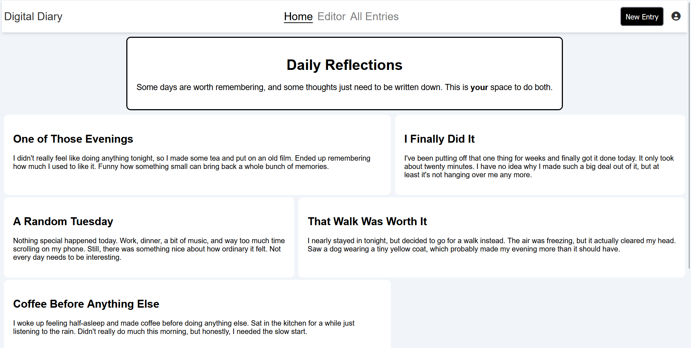
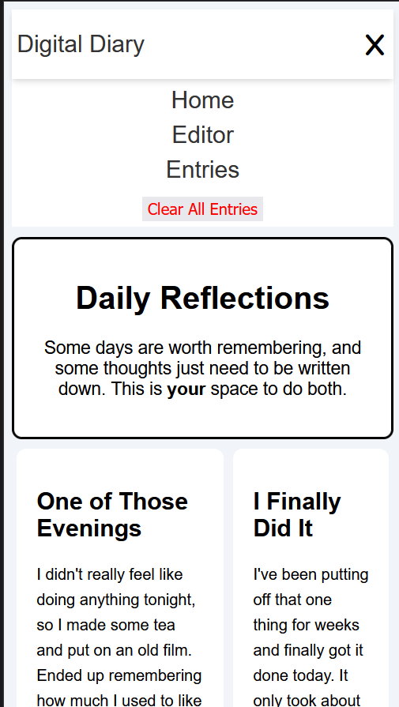
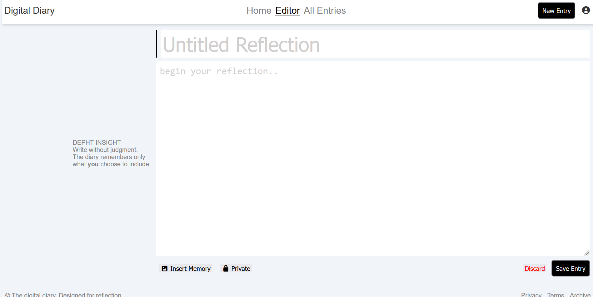
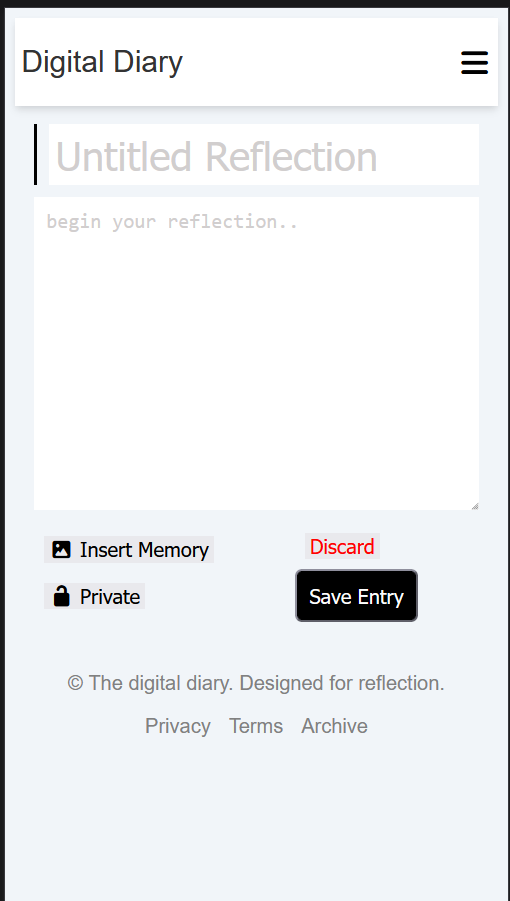
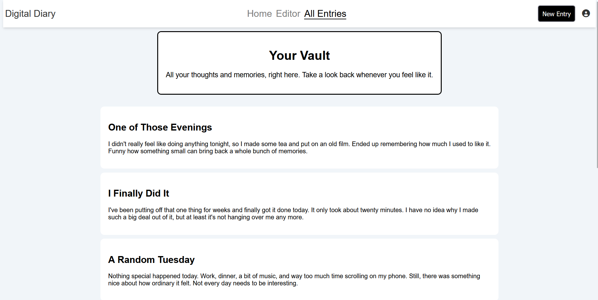
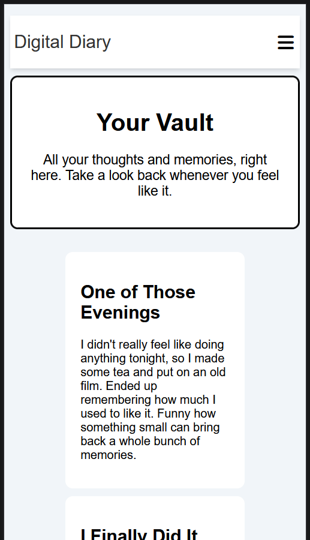

# Digital-Diary

A digital diary web application.

## Screenshots

### Home Page

### Editor

### All Entries

## Logic

### Home

The home page displays the 5(I used .slice(-5).reverse() on the array because slice(0, 5) displays the oldest five) most recent diary entries using for loops, createElement(div,h2,article and p) and appendChild to append them to the container.

### Editor

The editor saves a title and textarea in the localStorage using setItem(to store using a key) and getItem(get the info back using said key). An object "formData" is used to group the information which gets saved when the button "save entry" is clicked.

### All Entries

The entries are stored in an array and then saved to localStorage. I used
.slice(-5).reverse() to select the last five entries from the array and display the newest entries first thanks to .reverse(). the vault page just shows all the entries without slice.

## References

[Window: localStorage property](https://developer.mozilla.org/en-US/docs/Web/API/Window/localStorage)

[Array.prototype.slice()](https://developer.mozilla.org/en-US/docs/Web/JavaScript/Reference/Global_Objects/Array/slice)
